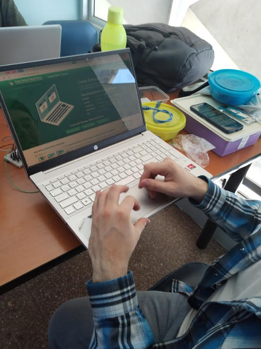
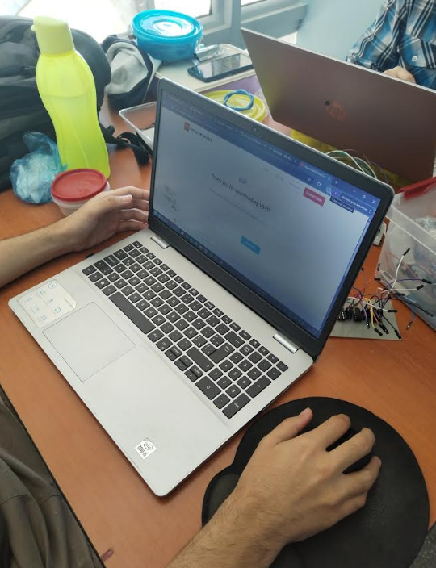
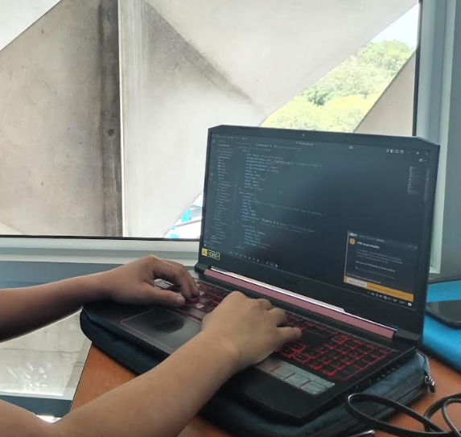
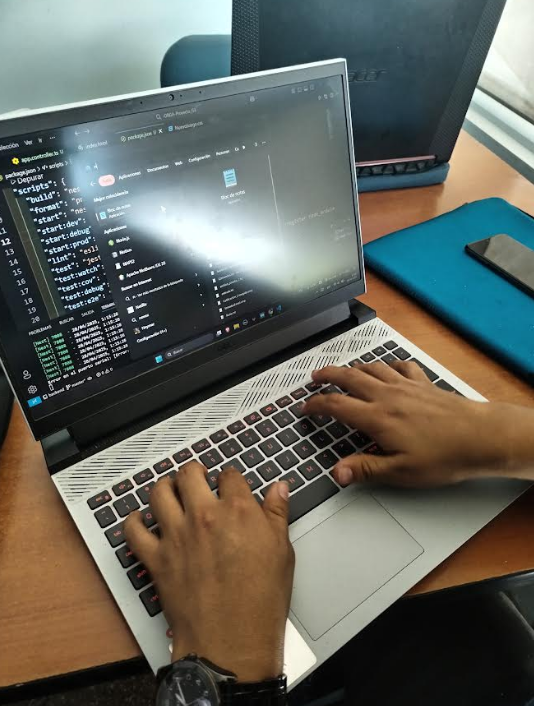
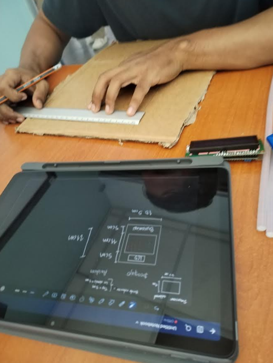

# UNIVERSIDAD DE SAN CARLOS DE GUATEMALA  
## FACULTAD DE INGENIERÍA  
### ORGANIZACIÓN COMPUTACIONAL  

**CATEDRÁTICO:** ING. OTTO RENE ESCOBAR LEIVA  
**TUTOR ACADÉMICO:** JUAN JOSUE ZULETA BEB  

    
    

        - 
    

##              Integrantes
 **Enner Esaí Mendizabal Castro** - 202302220  
 **Esteban Sánchez Túchez** - 202300769  
 **Juan José Sandoval Ruiz** - 202300710  
 **Brandon Antonio Marroquin Pérez** - 202300813  
 **David Estuardo Barrios Ramírez** - 202300670  

**GUATEMALA, 3 DE MAYO DEL 2025**  

# ÍNDICE  

1. [INTRODUCCIÓN](#introducción)
2. [OBJETIVOS](#objetivos)
    1. [Objetivo General](#objetivo-general)
    2. [Objetivos Específicos](#objetivos-específicos)
3. [DESCRIPCIÓN DEL PROBLEMA](#descripcion-del-problema)
4. [LÓGICA DEL SISTEMA](#lógica-del-sistema)
5. [FUNCIONES BOOLEANAS Y MAPAS DE KARNAUGH](#funciones-booleanas-y-mapas-de-karnaugh)
6. [DIAGRAMAS DE ESTADO](#diagramas-de-estado)
7. [DIAGRAMAS CON EXPLICACIÓN](#diagramas-con-explicación)
8. [DIAGRAMAS DEL DISEÑO DEL CIRCUITO](#diagramas-del-diseño-del-circuito)
9. [DIAGRAMA DEL CIRCUITO IMPRESO](#diagrama-del-circuito-impreso)
10. [EQUIPO UTILIZADO](#equipo-utilizado)
11. [PRESUPUESTO](#presupuesto)
12. [APORTE INDIVIDUAL DE CADA INTEGRANTE](#aporte-individual-de-cada-integrante)
    - [Enner Mendizabal - 202302220](#enner-mendizabal---202302220)
    - [Esteban Sánchez Túchez - 202300769](#esteban-sánchez-túchez---202300769)
    - [Juan José Sandoval Ruiz - 202300710](#juan-josé-sandoval-ruiz--202300710)
    - [David Estuardo Barrios Ramírez - 202300670](#david-estuardo-barrios-ramírez--202300670)
    - [Brandon Antonio Marroquín Pérez - 202300813](#brandon-antonio-marroquín-pérez-202300813)
13. [CONCLUSIONES](#conclusiones)
14. [RECOMENDACIONES](#recomendaciones)
15. [ANEXOS](#anexos)
16. [APORTE DE TODOS LOS INTEGRANTES DEL GRUPO](#aporte-de-todos-los-integrantes-del-grupo)
17. [FOTOGRAFÍA DE LOS CIRCUITOS FÍSICOS](#fotografía-de-los-circuitos-físicos)
18. [VIDEOS DEL FUNCIONAMIENTO DE MANERA SEPARADA](#videos-del-funcionamiento-de-manera-separada)

## INTRODUCCIÓN  
El presente proyecto tiene como finalidad, adentrarnos en la implementación de un juego interactivo basado en el clásico **Buscaminas**. Este prototipo deberá ser funcional mediante circuitos combinacionales y secuenciales, controlado tanto desde una plataforma web (front-end y back-end) como físicamente desde una placa implementada con componentes lógicos y comunicación serial. La experiencia busca reforzar el aprendizaje práctico de memorias RAM con Flip-Flops, comunicación serial y control de flujo de datos, fomentando el trabajo colaborativo mediante un sistema de control de versiones.

## OBJETIVOS  

## Objetivo General  
- Aplicar todos los conocimientos adquiridos en el curso sobre lógica combinacional y secuencial en la construcción de un prototipo funcional del juego Buscaminas.

## Objetivos Específicos  

1. Diseñar e implementar circuitos secuenciales y combinacionales que representen la lógica del juego.
2. Establecer comunicación serial entre el sistema físico (placa y Arduino) y una interfaz web para la configuración y control del juego.
3. Implementar una memoria RAM de 4x4 utilizando Flip-Flops para almacenar las posiciones de las bombas.

## Descripcion del Problema
Se desea incorporar un nuevo juego interactivo en su sistema operativo, y se ha encomendado el diseño de un prototipo del clásico juego Buscaminas. El desafío técnico consiste en implementar esta solución con circuitos lógicos y una arquitectura de dos capas (cliente-servidor), que incluya configuración de bombas mediante una interfaz web, comunicación con una placa a través de Arduino y Bluetooth, y validación del juego mediante señales LED y una pantalla LCD. El diseño debe ser preciso, ya que cualquier error en la integración de los módulos o en la implementación física del circuito impedirá su calificación.

## Lógica del Sistema
## 🛠 Configuración del Juego
Inicialización de la RAM:

El tablero de juego está representado por una memoria RAM 4x4 implementada físicamente con flip-flops.

La RAM debe ser configurada al inicio enviando datos a través de comunicación serial desde un frontend en una computadora.

El usuario puede configurar las bombas de dos formas:

Desde un archivo .org con las posiciones.

Desde una interfaz gráfica (pagina web).

Comunicación Serial:

Un backend recibe las instrucciones desde el frontend y envía los comandos hacia un Arduino conectado al circuito físico.

El Arduino interpreta los datos y coloca las bombas en las posiciones indicadas.

Indicación de Bombas:

Cada celda de la RAM tiene un LED asociado:

Encendido si hay bomba en esa posición.

Apagado si no hay bomba.

## 🎮 Modo de Juego
Inicio de la Partida:

El juego inicia con el estado "Jugando", encendiendo un LED azul.

Selección de Casillas:

El jugador, usando su celular por Bluetooth (módulo HC-06), envía la posición que quiere verificar (entre 1 y 16).

El Arduino recibe la posición, consulta la RAM, y determina:

Si es bomba:

Se muestra "Game Over" en una pantalla LCD.

Se enciende el LED rojo de "Fin del juego".

El juego termina hasta reiniciar.

Si NO es bomba:

Se marca la posición como descubierta.

Se incrementa el puntaje en 1 y se actualiza en la LCD.

Victoria:

Si el jugador descubre todas las casillas sin bombas, se muestra "Ganaste" en la pantalla LCD y se enciende el LED verde.

Reinicio:

Para reiniciar, el usuario debe enviar el comando "reinicio" vía Bluetooth, lo que:

Resetea el tablero.

Apaga los LEDs de victoria o game over.

Vuelve al estado de configuración inicial.

## ⚙ Estados del Juego (Control de LEDs)
Jugando → LED azul encendido.

Game Over → LED rojo encendido.

Ganaste → LED verde encendido.

Los estados son mutuamente excluyentes: solo un LED puede estar activo a la vez.

## 🖥 Comunicación General
Frontend: Página web que permite:

Configurar bombas (manual o por archivo).

Backend:

Recibe configuración del frontend.

Envía datos al Arduino por serial.

Arduino:

Controla la RAM física.

Procesa las jugadas enviadas desde el celular vía Bluetooth.

## Diagramas de Estado

## Diagramas con Explicación

## Diagramas del Diseño del Circuito

## DIAGRAMA DEL CIRCUITO IMPRESO  

## Equipo Utilizado

El equipo utilizado para la realización del proyecto, tanto adquirido como proporcionado por los miembros del equipo, incluye:

- **Cautín de 60 watts**
- **Taladro con broca de 1/32**
- **Resistencias varias**
- **Luces LED color rojo**
- **Dip Switch**
- **Borneras de 2 y 3 terminales**
- **Estaño**
- **Esponja para limpiar estaño**
- **Cable para protoboard**
- **Protoboard**
- **Placas de fibra de vidrio**
- **Duroport**
- **Ttermocogible**
- **Cables Dupont**
- **FLIB-FLOP**
- **Arduino Mega**
- **Modulo Bluetooth**
- **Pantalla LCD de 16x2**

## PRESUPUESTO  
--------------

## APORTE INDIVIDUAL DE CADA INTEGRANTE  

## Enner Mendizábal - 202302220
Se desempeñó como coordinador general del grupo, liderando y organizando las actividades en todo momento para asegurar el cumplimiento de los objetivos propuestos. Fue responsable del diseño y construcción de la memoria RAM, tanto en el entorno de simulación (Proteus) como en el montaje físico. Asimismo, llevó a cabo el proceso de soldadura de la placa de la RAM, garantizando su correcto ensamblaje y funcionamiento. Además, elaboró tanto el manual técnico como el manual de usuario del proyecto, proporcionando documentación clara y detallada para el manejo y comprensión del sistema desarrollado.

## Esteban Sánchez Túchez - 202300769
Se encargó de establecer y configurar la comunicación entre la matriz de LEDs y el Arduino, tanto en el entorno de simulación (Proteus) como en el hardware físico. También colaboró activamente en el proceso de instalación de la RAM y participó en el desarrollo de la estructura del backend del proyecto, aportando soluciones prácticas y eficientes para la correcta funcionalidad del sistema.

## Juan José Sandoval Ruiz - 202300710
Tuvo a su cargo la creación y diseño de la maqueta física del proyecto, destacándose por su creatividad al lograr una presentación dinámica y estéticamente atractiva. Además, fue responsable de establecer la conexión entre el dispositivo móvil y la aplicación mediante tecnología Bluetooth, facilitando la interacción entre el usuario y el sistema de manera eficiente.

## David Estuardo Barrios Ramírez - 202300670
Se responsabilizó de desarrollar la lógica de jugabilidad en el backend del sistema, asegurando una experiencia de usuario fluida y funcional. Asimismo, trabajó en el diseño de la pantalla de "Nuevo Juego" en el frontend, cuidando aspectos visuales y de usabilidad para mejorar la interfaz gráfica del proyecto.

## Brandon Antonio Marroquín Pérez - 202300813
Administró de manera eficiente el presupuesto asignado al grupo, garantizando una correcta distribución de los recursos materiales y financieros necesarios para cada etapa del proyecto. Elaboró el informe final del grupo, documentando detalladamente los procesos, avances y resultados obtenidos. También contribuyó activamente en el desarrollo del frontend del proyecto, en especial en las secciones relacionadas con la jugabilidad en HTML. Además, asumió la responsabilidad total del proceso de fabricación de las placas, incluyendo el planchado, la inmersión en ácido, el pulido y el acabado final, asegurando un trabajo de alta precisión, calidad y presentación estética.

## CONCLUSIONES  

- La implementación del juego Buscaminas a través de circuitos físicos y control serial representa una oportunidad ideal para aplicar de forma tangible los principios de organización computacional.
- El proyecto permite reforzar habilidades en diseño digital, electrónica, comunicación serial, y gestión colaborativa de software mediante ramas en un repositorio.
- La correcta integración de hardware y software es clave para lograr un sistema funcional, destacando la importancia de la planificación, el diseño modular y las pruebas integrales.

## Recomendaciones
- Implementar la RAM con 16 flip-flops tipo D.
- Usar decodificadores para seleccionar cada celda.
- Dividir el sistema en módulos: configuración, juego, estados, comunicación.
- Simular antes de montar en placa (usar Logisim o Proteus).
- Crear un front-end web para ubicar bombas y cargar archivos .org.
- Backend debe enviar datos al Arduino por serial.
- Verificar el módulo HC-06 antes de integrarlo.
- Comandos simples: VER <pos>, REINICIO.
- LED azul: jugando, rojo: game over, verde: ganaste.
- Validar que no se juegue sin configurar primero.
- El botón “Nuevo Juego” debe resetear todo.
- Usar ramas main, develop, feature/<funcionalidad_carnet>.
- Realizar commits claros y frecuentes.
- Toda la documentación en formato Markdown.
- Probar el flujo completo antes de entregar.

## ANEXOS  

## APORTE DE TODOS LOS INTEGRANTES DEL GRUPO  

## FOTOGRAFÍA DE LOS CIRCUITOS FÍSICOS  

## Videos del funcionamiento de manera separada
<!-- Bootstrap CSS -->
<link href="https://cdn.jsdelivr.net/npm/bootstrap@5.3.0/dist/css/bootstrap.min.css" rel="stylesheet">

    <h5>Video 1: Prueba de la ram en Proteus</h5>
    <a href="https://drive.google.com/file/d/1MYDP4kPjVaeLNfP_WM1HMH3yRQsBn5o6/view?usp=sharing" 
       target="_blank" 
       class="btn btn-primary btn-lg shadow-lg">
        🎥 Ver Video
    </a>
    <h5>Video 2: --------</h5>
    <a href="---------------" 
       target="_blank" 
       class="btn btn-primary btn-lg shadow-lg">
        🎥 Ver Video
    </a>
    <h5>Video 3: ------------</h5>
    <a href="--------------" 
       target="_blank" 
       class="btn btn-primary btn-lg shadow-lg">
        🎥 Ver Video
    </a>
    <h5>Video 4:------------</h5>
    <a href="--------" 
       target="_blank" 
       class="btn btn-primary btn-lg shadow-lg">
        🎥 Ver Video
    </a>
    <h5>Video 5: ---------</h5>
    <a href="------------------------" 
       target="_blank" 
       class="btn btn-primary btn-lg shadow-lg">
        🎥 Ver Video
    </a>
    <h5>Video 6:---------------</h5>
    <a href="---------------" 
       target="_blank" 
       class="btn btn-primary btn-lg shadow-lg">
        🎥 Ver Video
    </a>

