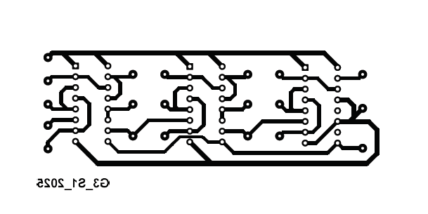
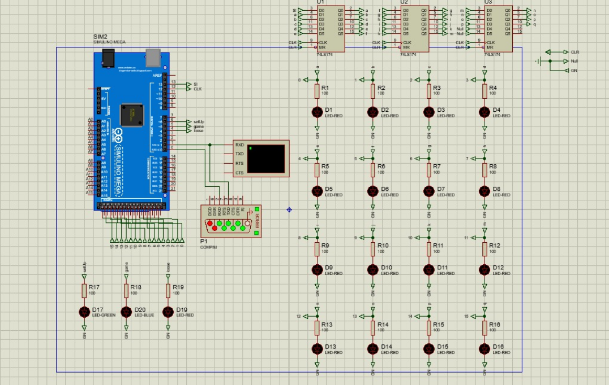
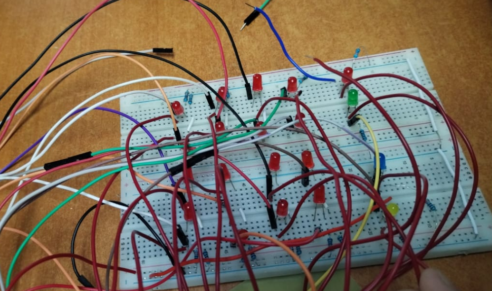
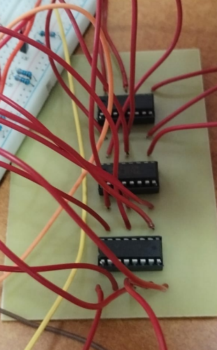
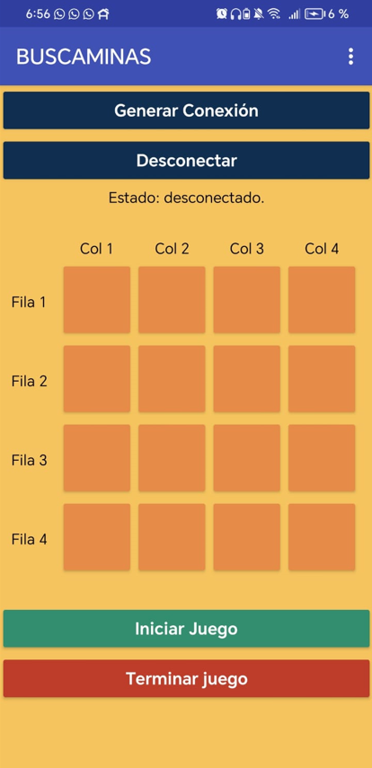

<div align="center" style="font-family: 'Times New Roman', Times, serif;">

# UNIVERSIDAD DE SAN CARLOS DE GUATEMALA  
## FACULTAD DE INGENIERÍA  
### ORGANIZACIÓN COMPUTACIONAL  

**CATEDRÁTICO:** ING. OTTO RENE ESCOBAR LEIVA  
**TUTOR ACADÉMICO:** JUAN JOSUE ZULETA BEB  


<div style="position: relative; display: inline-block;">
    
    <div style="position: absolute; top: 20px; left: 50px; color: white; font-size: 24px; font-weight: bold;">
        - 
    </div>
</div>


##              Integrantes
 **Enner Esaí Mendizabal Castro** - 202302220  
 **Esteban Sánchez Túchez** - 202300769  
 **Juan José Sandoval Ruiz** - 202300710  
 **Brandon Antonio Marroquin Pérez** - 202300813  
 **David Estuardo Barrios Ramírez** - 202300670  

**GUATEMALA, 3 DE MAYO DEL 2025**  
</div>

<div style="font-family: 'Times New Roman', Times, serif;">

# ÍNDICE

1. [INTRODUCCIÓN](#introducción)
2. [OBJETIVOS](#objetivos)
   1. [Objetivo General](#objetivo-general)
   2. [Objetivos Específicos](#objetivos-específicos)
3. [DESCRIPCIÓN DEL PROBLEMA](#descripcion-del-problema)
4. [LÓGICA DEL SISTEMA](#lógica-del-sistema)
   1. [Descripción Funcional de la Interfaz del Juego](#descripción-funcional-de-la-interfaz-del-juego)
5. [CÓDIGO CON EXPLICACIÓN](#codigo-con-explicación)
6. [DIAGRAMA DEL CIRCUITO IMPRESO](#diagrama-del-circuito-impreso)
7. [EQUIPO UTILIZADO](#equipo-utilizado)
8. [PRESUPUESTO](#presupuesto)
9. [APORTE INDIVIDUAL DE CADA INTEGRANTE](#aporte-individual-de-cada-integrante)
10. [CONCLUSIONES](#conclusiones)
11. [RECOMENDACIONES](#recomendaciones)
12. [ANEXOS](#anexos)
    1. [Aporte de Todos los Integrantes del Grupo](#aporte-de-todos-los-integrantes-del-grupo)
    2. [Fotografía de los Circuitos Físicos](#fotografía-de-los-circuitos-físicos)
    3. [Videos del Funcionamiento de Manera Separada](#videos-del-funcionamiento-de-manera-separada)


## INTRODUCCIÓN  
El presente proyecto tiene como finalidad, adentrarnos en la implementación de un juego interactivo basado en el clásico **Buscaminas**. Este prototipo deberá ser funcional mediante circuitos combinacionales y secuenciales, controlado tanto desde una plataforma web (front-end y back-end) como físicamente desde una placa implementada con componentes lógicos y comunicación serial. La experiencia busca reforzar el aprendizaje práctico de memorias RAM con Flip-Flops, comunicación serial y control de flujo de datos, fomentando el trabajo colaborativo mediante un sistema de control de versiones.


## OBJETIVOS  

## Objetivo General  
- Aplicar todos los conocimientos adquiridos en el curso sobre lógica combinacional y secuencial en la construcción de un prototipo funcional del juego Buscaminas.


## Objetivos Específicos  

1. Diseñar e implementar circuitos secuenciales y combinacionales que representen la lógica del juego.
2. Establecer comunicación serial entre el sistema físico (placa y Arduino) y una interfaz web para la configuración y control del juego.
3. Implementar una memoria RAM de 4x4 utilizando Flip-Flops para almacenar las posiciones de las bombas.


## Descripcion del Problema
Se desea incorporar un nuevo juego interactivo en su sistema operativo, y se ha encomendado el diseño de un prototipo del clásico juego Buscaminas. El desafío técnico consiste en implementar esta solución con circuitos lógicos y una arquitectura de dos capas (cliente-servidor), que incluya configuración de bombas mediante una interfaz web, comunicación con una placa a través de Arduino y Bluetooth, y validación del juego mediante señales LED y una pantalla LCD. El diseño debe ser preciso, ya que cualquier error en la integración de los módulos o en la implementación física del circuito impedirá su calificación.

# Lógica del Sistema
## Descripción Funcional de la Interfaz del Juego

Al iniciar el juego, se abrirá la **ventana principal**, donde encontraremos las opciones principales del sistema. A continuación, se detallan:

## 1. Nuevo Juego
- Permite comenzar una nueva partida desde cero.
- Al presionar este botón, se cargará nuevamente la ventana principal del juego, reiniciando cualquier configuración o progreso anterior.

## 2. Configurar Juego - Cargar Archivo
- Al seleccionar esta opción, se abrirá una ventana del sistema de archivos.
- El usuario podrá elegir un archivo que contenga las coordenadas para configurar el juego.
- Las coordenadas seleccionadas se cargarán automáticamente en un área de texto (**textArea**) dentro de la interfaz.

## 3. Configurar Juego - Enviar Coordenadas
- Con las coordenadas ya visibles en el textArea, el usuario puede presionar este botón para enviarlas al sistema.
- El sistema interpretará las coordenadas y las usará como configuración inicial del juego.

## 4. Configuración Personalizada
- Al hacer clic en este botón, se abrirá una **nueva ventana**.
- En ella, el usuario podrá seleccionar manualmente las posiciones donde desea colocar las bombas.
- Esto se realiza mediante botones que representan las diferentes posiciones del tablero.

## 5. Iniciar Juego
- Esta opción abre una ventana dedicada al desarrollo del juego.
- El jugador podrá seleccionar casillas en el tablero.
- Si el jugador selecciona una casilla con bomba, aparecerá una **ventana emergente** que indicará el evento.
- El usuario podrá elegir entre:
  - Comenzar un nuevo juego.
  - Volver al menú principal.

---

## Codigo con Explicación

```c
#include <LiquidCrystal_I2C.h> // Librería para controlar la pantalla LCD I2C

// Pines de conexión
const int DATA_PIN = 13; // Pin para enviar datos a la RAM
const int CLK_PIN = 12;  // Pin para el reloj de la RAM
const int pos[4][4] = {   // Matriz de pines que representan las posiciones del tablero
  {23, 25, 27, 29}, 
  {31, 33, 35, 37}, 
  {39, 41, 43, 45}, 
  {47, 49, 51, 53}
};
const int configLed = 6;  // LED indicador de modo configuración
const int gameLed = 5;    // LED indicador de modo juego
const int winLed = 4;     // LED indicador de victoria
const int looseLed = 3;   // LED indicador de derrota

// Inicialización de la pantalla LCD
LiquidCrystal_I2C lcd(0x27, 16, 2); // Dirección I2C 0x27, pantalla de 16x2

void setup() {
  lcd.init();           // Inicializa la pantalla LCD
  lcd.backlight();      // Activa la luz de fondo
  lcd.clear();          // Limpia la pantalla
  lcd.display();        // Activa la pantalla
  print("<- BUSCAMINAS ->", 0); // Muestra un mensaje inicial
  Serial.begin(9600);   // Configura la comunicación serial con la PC
  Serial1.begin(9600);  // Configura la comunicación serial con Bluetooth
  delay(1000);

  // Configuración de pines de salida
  pinMode(DATA_PIN, OUTPUT);
  pinMode(CLK_PIN, OUTPUT);
  digitalWrite(DATA_PIN, LOW);
  digitalWrite(CLK_PIN, LOW);

  // Configuración de LEDs
  pinMode(configLed, OUTPUT);
  pinMode(gameLed, OUTPUT);
  pinMode(looseLed, OUTPUT);
  digitalWrite(configLed, LOW);
  digitalWrite(gameLed, LOW);
  digitalWrite(looseLed, LOW);

  // Configuración de pines de entrada para las posiciones del tablero
  for (int i = 0; i < 4; i++) {
    for (int j = 0; j < 4; j++) {
      pinMode(pos[i][j], INPUT);
    }
  }
}

void loop() {
  // Verifica si hay datos disponibles desde la PC o Bluetooth
  if (Serial.available()) {
    handleInput(Serial); // Maneja la entrada desde la PC
  }

  if (Serial1.available()) {
    handleInput(Serial1); // Maneja la entrada desde Bluetooth
  }
}

// Función para manejar la entrada de datos
void handleInput(Stream &port) {
  String mode = "";

  if (port.available()) {
    mode = port.readString(); // Lee el modo enviado (configuration o game)

    if (mode == "configuration") {
      turnOnConfigLed(); // Activa el LED de configuración
      lcd.clear();
      print("MODO", 0);
      print("CONFIGURACION", 1);
      while (true) {
        if (port.peek() == 'X') { // Salida del modo configuración
          port.read();
          lcd.clear();
          print("Salida del", 0);
          print("modo config.", 1);
          turnOffAll();
          mode = "";
          break;
        } else if (port.available() >= 2) { // Recibe datos de configuración
          byte ram_data[2];
          ram_data[0] = port.read(); // LSB (bits 0-7)
          ram_data[1] = port.read(); // MSB (bits 8-15)
          lcd.clear();
          print("Datos", 0);
          print("recibidos", 1);
          delay(200);
          port.print("Byte 0: ");
          port.println(ram_data[0], BIN);
          port.print("Byte 1: ");
          port.println(ram_data[1], BIN);

          writeToRAM(ram_data); // Escribe los datos en la RAM
        }
      }
    } else if (mode == "game") {
      turnOnGameLed(); // Activa el LED de juego
      lcd.clear();
      print("MODO", 0);
      print("JUEGO", 1);
      int pos_whitout_bombs = 16 - getNumBombs(); // Calcula posiciones sin bombas
      int verified_pos = 0; // Contador de posiciones verificadas
      while (true) {
        if (port.peek() == 'X') { // Salida del modo juego
          port.read();
          lcd.clear();
          print("X - salida juego.", 1);
          turnOffAll();
          mode = "";
          break;
        } else if (port.available() >= 1) { // Recibe posición seleccionada
          String text = port.readString();
          int num = text.toInt() - 1;

          if (num > 15 || num < 0) { // Valida la posición
            lcd.clear();
            print("Numero de", 0);
            print("posicion invalida.", 1);
            continue;
          }

          int row = num / 4; // Calcula la fila
          int column = num % 4; // Calcula la columna
          int estado = digitalRead(pos[row][column]); // Lee el estado de la posición

          if (estado == HIGH) { // Si hay bomba
            lcd.clear();
            print("HAY BOMBA", 0);
            print("PERDISTE", 1);
            turnOnLooseLed(); // Activa el LED de derrota
            break;
          } else { // Si no hay bomba
            lcd.clear();
            print("NO HAY BOMBA", 0);
            verified_pos++;
          }

          if (verified_pos >= pos_whitout_bombs) { // Si se verificaron todas las posiciones sin bombas
            lcd.clear();
            print("-- GANASTE --", 0);
            turnOnWinLed(); // Activa el LED de victoria
            break;
          }
        }
      }
    }
  }
}

// Función para generar un pulso de reloj
void pulseClock() {
  digitalWrite(CLK_PIN, HIGH);
  delay(50);
  digitalWrite(CLK_PIN, LOW);
  delay(50);
}

// Función para escribir datos en la RAM
void writeToRAM(byte data[]) {
  for (int i = 15; i >= 0; i--) {
    byte currentByte = data[i / 8];
    byte bitValue = (currentByte >> (i % 8)) & 0x01;

    digitalWrite(DATA_PIN, bitValue);
    pulseClock();
  }
}

// Función para contar el número de bombas
int getNumBombs() {
  int num_bombs = 0;
  for (int i = 0; i < 4; i++) {
    for (int j = 0; j < 4; j++) {
      if (digitalRead(pos[i][j]) == HIGH)
        num_bombs++;
    }
  }
  return num_bombs;
}

// Funciones para controlar los LEDs
void turnOnConfigLed() {
  digitalWrite(configLed, HIGH);
  digitalWrite(gameLed, LOW);
  digitalWrite(looseLed, LOW);
  digitalWrite(winLed, LOW);
}

void turnOnGameLed() {
  digitalWrite(configLed, LOW);
  digitalWrite(gameLed, HIGH);
  digitalWrite(looseLed, LOW);
  digitalWrite(winLed, LOW);
}

void turnOnWinLed() {
  digitalWrite(configLed, LOW);
  digitalWrite(gameLed, LOW);
  digitalWrite(looseLed, LOW);
  digitalWrite(winLed, HIGH);
}

void turnOnLooseLed() {
  digitalWrite(configLed, LOW);
  digitalWrite(gameLed, LOW);
  digitalWrite(looseLed, HIGH);
  digitalWrite(winLed, LOW);
}

void turnOffAll() {
  digitalWrite(configLed, LOW);
  digitalWrite(gameLed, LOW);
  digitalWrite(looseLed, LOW);
  digitalWrite(winLed, LOW);
}

// Función para centrar texto en la pantalla LCD
int centerText(String text) {
  int textLength = text.length();
  if (textLength > 16)
    return 0;
  return (16 - textLength) / 2;
}

// Función para imprimir texto en la pantalla LCD
void print(String text, int row) {
  lcd.setCursor(centerText(text), row);
  lcd.print(text);
}

```

## DIAGRAMA DEL CIRCUITO IMPRESO  




## Equipo Utilizado

El equipo utilizado para la realización del proyecto, tanto adquirido como proporcionado por los miembros del equipo, incluye:

- **Cautín de 60 watts**
- **Taladro con broca de 1/32**
- **Resistencias varias**
- **Luces LED color rojo**
- **Dip Switch**
- **Borneras de 2 y 3 terminales**
- **Estaño**
- **Esponja para limpiar estaño**
- **Cable para protoboard**
- **Protoboard**
- **Placas de fibra de vidrio**
- **Duroport**
- **Ttermocogible**
- **Cables Dupont**
- **FLIB-FLOP**
- **Arduino Mega**
- **Modulo Bluetooth**
- **Pantalla LCD de 16x2**


## PRESUPUESTO  
| Fecha       | Presupuesto                        | Q       |
|------------|------------------------------------|--------|
| <span class="th">24/04/2025</span> | LCD                  | Q51.00  |
|            |LCD SOLDADO                          | Q51.00  |
|            | GASTOS VARIOS        | Q150.00  |
|            | <span class="subtotal">subtotal</span>                        | <span class="subtotal">Q252.00</span>  |
| <span class="fa">25/04/2025</span> | JUMPERS Y LEDS               | Q15.25  |
|            | PIZZAS PAPA JOHNS   | Q116.00  |
|            | <span class="subtotal">subtotal</span>                        | <span class="subtotal">Q60.00</span>  |
| <span class="feha">28/04/2025</span>| 3 BARRITA DE SILICON                          | Q3.00  |
|            | GASTOS VARIOS   | Q53.00  |
|            | <span class="subtotal">subtotal</span>                        | <span class="subtotal">Q56.00</span>  
|            | <span class="total">TOTAL ABSOLUTO</span>                 | <span class="total">Q439.25</span>  |


## APORTE INDIVIDUAL DE CADA INTEGRANTE  


## Enner Mendizábal - 202302220
Se desempeñó como coordinador general del grupo, liderando y organizando las actividades en todo momento para asegurar el cumplimiento de los objetivos propuestos. Fue responsable del diseño y construcción de la memoria RAM, tanto en el entorno de simulación (Proteus) como en el montaje físico. Asimismo, llevó a cabo el proceso de soldadura de la placa de la RAM, garantizando su correcto ensamblaje y funcionamiento. Además, elaboró tanto el manual técnico como el manual de usuario del proyecto, proporcionando documentación clara y detallada para el manejo y comprensión del sistema desarrollado.

## Esteban Sánchez Túchez - 202300769
Se encargó de establecer y configurar la comunicación entre la matriz de LEDs y el Arduino, tanto en el entorno de simulación (Proteus) como en el hardware físico. También colaboró activamente en el proceso de instalación de la RAM y participó en el desarrollo de la estructura del backend del proyecto, aportando soluciones prácticas y eficientes para la correcta funcionalidad del sistema.

## Juan José Sandoval Ruiz - 202300710
Tuvo a su cargo la creación y diseño de la maqueta física del proyecto, destacándose por su creatividad al lograr una presentación dinámica y estéticamente atractiva. Además, fue responsable de establecer la conexión entre el dispositivo móvil y la aplicación mediante tecnología Bluetooth, facilitando la interacción entre el usuario y el sistema de manera eficiente.

## David Estuardo Barrios Ramírez - 202300670
Se responsabilizó de desarrollar la lógica de jugabilidad en el backend del sistema, asegurando una experiencia de usuario fluida y funcional. Asimismo, trabajó en el diseño de la pantalla de "Nuevo Juego" en el frontend, cuidando aspectos visuales y de usabilidad para mejorar la interfaz gráfica del proyecto.

## Brandon Antonio Marroquín Pérez - 202300813
Administró de manera eficiente el presupuesto asignado al grupo, garantizando una correcta distribución de los recursos materiales y financieros necesarios para cada etapa del proyecto. Elaboró el informe final del grupo, documentando detalladamente los procesos, avances y resultados obtenidos. También contribuyó activamente en el desarrollo del frontend del proyecto, en especial en las secciones relacionadas con la jugabilidad en HTML. Además, asumió la responsabilidad total del proceso de fabricación de las placas, incluyendo el planchado, la inmersión en ácido, el pulido y el acabado final, asegurando un trabajo de alta precisión, calidad y presentación estética.


## CONCLUSIONES  

- La implementación del juego Buscaminas a través de circuitos físicos y control serial representa una oportunidad ideal para aplicar de forma tangible los principios de organización computacional.
- El proyecto permite reforzar habilidades en diseño digital, electrónica, comunicación serial, y gestión colaborativa de software mediante ramas en un repositorio.
- La correcta integración de hardware y software es clave para lograr un sistema funcional, destacando la importancia de la planificación, el diseño modular y las pruebas integrales.

## Recomendaciones
- Implementar la RAM con 16 flip-flops tipo D.
- Usar decodificadores para seleccionar cada celda.
- Dividir el sistema en módulos: configuración, juego, estados, comunicación.
- Simular antes de montar en placa (usar Logisim o Proteus).
- Crear un front-end web para ubicar bombas y cargar archivos .org.
- Backend debe enviar datos al Arduino por serial.
- Verificar el módulo HC-06 antes de integrarlo.
- Comandos simples: VER <pos>, REINICIO.
- LED azul: jugando, rojo: game over, verde: ganaste.
- Validar que no se juegue sin configurar primero.
- El botón “Nuevo Juego” debe resetear todo.
- Usar ramas main, develop, feature/<funcionalidad_carnet>.
- Realizar commits claros y frecuentes.
- Toda la documentación en formato Markdown.
- Probar el flujo completo antes de entregar.

## ANEXOS  


## APORTE DE TODOS LOS INTEGRANTES DEL GRUPO  


## FOTOGRAFÍA DE LOS CIRCUITOS

### - Ram en Proteus


### - Ram en protoboard


### - Ram en placa



## - aplicacion



## Videos del funcionamiento de manera separada
<!-- Bootstrap CSS -->
<link href="https://cdn.jsdelivr.net/npm/bootstrap@5.3.0/dist/css/bootstrap.min.css" rel="stylesheet">

<div class="container text-center mt-5">
    <h5>Video 1: Prueba de la ram en Protoboard</h5>
    <a href="https://drive.google.com/file/d/1MYDP4kPjVaeLNfP_WM1HMH3yRQsBn5o6/view?usp=sharing" 
       target="_blank" 
       class="btn btn-primary btn-lg shadow-lg">
        🎥 Ver Video
    </a>
    <h5>Video 2: Ram en placa y probandolo con el LCD</h5>
    <a href="https://drive.google.com/file/d/1JMUuILzad8HFPqNjC0d8QVsLsHt01JjZ/view?usp=sharing" 
       target="_blank" 
       class="btn btn-primary btn-lg shadow-lg">
        🎥 Ver Video
    </a>
    <h5>Video 3: Funcionalidad del backend y frontend</h5>
    <a href="https://drive.google.com/file/d/19ZeDQyc5qT1bdo5cv2Qly2aTSof01lJx/view?usp=sharing" 
       target="_blank" 
       class="btn btn-primary btn-lg shadow-lg">
        🎥 Ver Video
    </a>
    <h5>Video 4: Funcionalidad de todo junto</h5>
    <a href="https://drive.google.com/file/d/1nDN0HsQiQ_JvGFpWvRwB1NZzscH7f67f/view?usp=sharing" 
       target="_blank" 
       class="btn btn-primary btn-lg shadow-lg">
        🎥 Ver Video
    </a>
</div>
</div>
